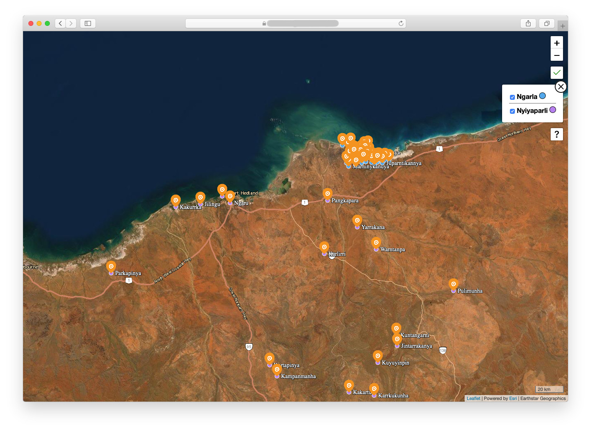
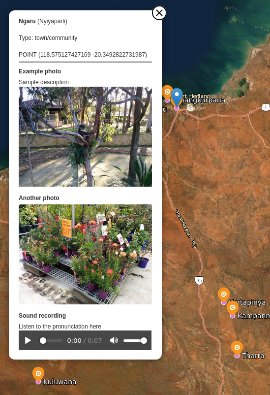
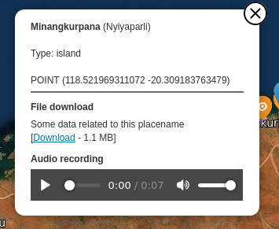

Aboriginal Placename Mapping System
===================================

**All-in-one system to store and display Australian Aboriginal place-name data on an interactive online map.**

All spatial data is stored in the database using spatial reference WGS84 (SRID ESRI:4326) for compatability with the web map software.

Designed to supplement the Discovery Song Database with a focus on displaying/publishing geographical data.

Screenshots
===========
*See the website in action!*

Credits
=======
### Dependencies
- [Python](https://www.python.org/)
- [Django Web Framework](https://www.djangoproject.com/)

### Software with sources referenced, included and/or modified in this repository:

- [Leaflet Maps](https://leafletjs.com)
- [Leaflet.LabelTextCollision](https://github.com/yakitoritabetai/Leaflet.LabelTextCollision)
  (Working version from [https://yakitoritabetai.github.io/Leaflet.LabelTextCollision/dist/L.LabelTextCollision.js])
- [Leaflet.Canvas-Markers](https://github.com/corg/Leaflet.Canvas-Markers)
- [RBush 2D R-tree spatial index](https://github.com/mourner/rbush)
- [leaflet-responsive-popup](https://github.com/yafred/leaflet-responsive-popup)
- [jQuery API](https://jquery.org/)
- [Esri Leaflet plugin](https://github.com/esri/esri-leaflet)
  and thanks to ESRI for providing free access to satellite map imagery and layers for development and small deployments.

### Images and Media
- [Indigenous Mapping Icons](https://www.imwaustralia.com/resources) - see src/static/images/imwicons/
- [CSS loading icons](https://github.com/lukehaas/css-loaders)
- [Bootstrap Icons](https://github.com/twbs/icons)

License
=======
This project is released under the MIT License. See [LICENSES.md] for details, including copies of license texts from included open source code.

Installation
============

See [docs/INSTALLING.md] for technical instructions on how to install this software for yourself.

