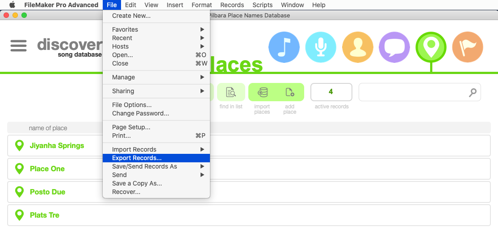
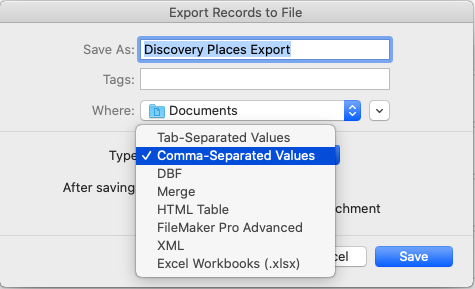
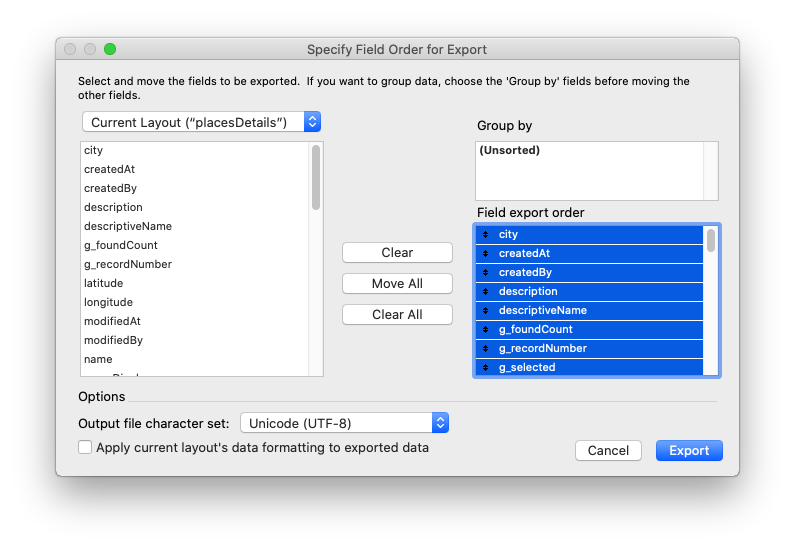
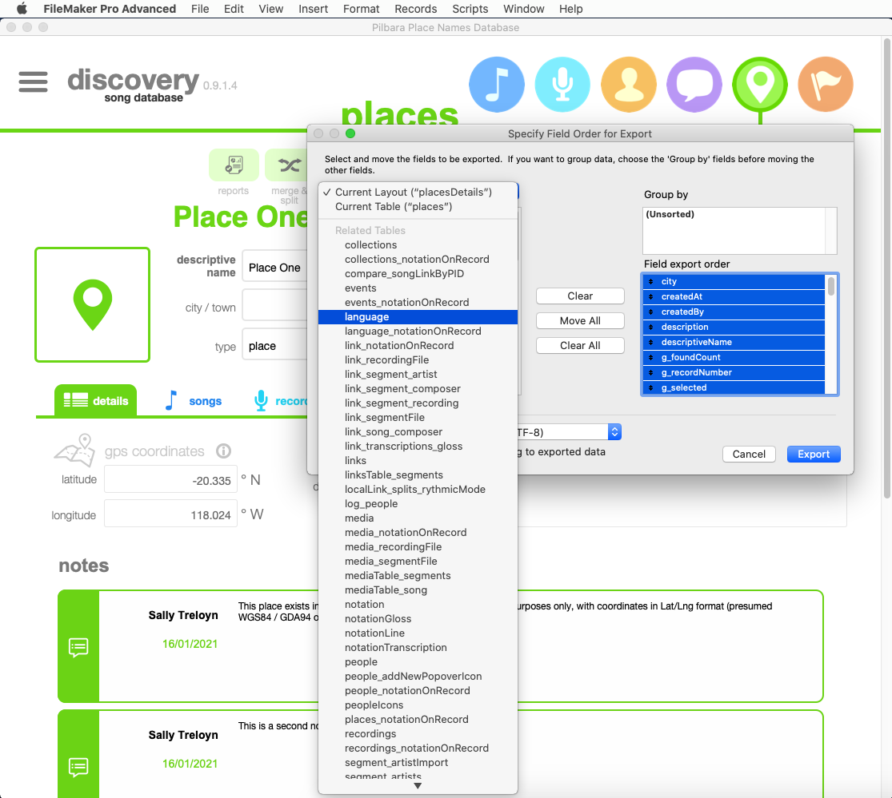

Importing Data into Online Map Database
=======================================

## Using the Admin Web Interface

### Export Data from Discovery Database in the correct format
1. Open the Discovery Database in Filemaker Pro and open the **Places** tab. Find the menus and select **File -> Export Records...**


2. Select **Comma-Separated Values** as the File Type. *The website will only work with Comma-Separated Value (CSV) files*


3. Click **Save** to continue.

4. Select all the fields in the **placesDetails** layout by finding it in the dropdown (top left) then clicking the **Move All** button. 


5. Repeat the process to add all the fields from the Related Tables: **language** and **notation**



### Import a CSV file using the Admin Site

1. Go to the Admin site (eg. https://maps.mydomain.org.au/admin) and login.
2. Find the **Import** link next to **Places** on the left-side panel.
3. **Upload the CSV file** and enter a name for the Data Source (this will be useful to track where the data was imported from later)
4. Select the correct column mapping from the list - there are some presets for certain spreadsheet types.

## Using Terminal (advanced)

### Import Spreadsheet Data via Terminal
**This is for advanced users only! You will need terminal access to the Maps web server for this method.**

Initially designed for bulk import of GEONOMA database from CSV format. This is available in various formats via https://catalogue.data.wa.gov.au/dataset/geographic-names-geonoma

You need to know:
- Spatial reference / projection (SRID) of source data
- Which columns in source CSV file map to which fields in the place database

1. Login to the web server (eg. via SSH)
2. Copy the CSV file onto the server to a path accessible by the web service user. If the spreadsheet isn't in CSV format, then save it as CSV.
3. Change to the web service user and use the manage.py command to import:
```
sudo su - www-data -s /bin/bash
cd $PLACEDB_GIT_PATH
source $PYTHON_HOME/bin/activate
src/manage.py import_csv $CSV_FILE $COLMAP_NAME
```

## TXT

Text files are expected to have a specific format, corresponding to the data export of some sort of linguistic database software (possibly Toolbox).

First line of each file is the data description, second line is date of extract, then one or more blank lines.
Records start with the name on one line followed by fields, and are separated by a blank line.
Fields start with `\` and a two-letter field name `xx` and data. Field data may be split across multiple lines.

Sample text file with one record:
```
Martuthunira Place Names
04/05/2020


Yarti
\mr
\ps n
\ge Cane_River
\re Cane River ; River, Cane
\de name of the Cane River
\sd Names and Placenames
\so ADM
\rf
\xv
\xe
\cf Yartira
\nt
\dt 28/Nov/2008
```
